# How to Disable VBS

This guide is intended to resolve issues where you get a message saying that nested virtualization support is not enabled. This usually appears when you go to power on a VM that has virtualization support enabled on the VM’s processor.

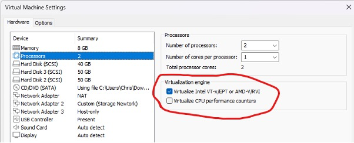

The error when powering on the machine looks like this (if using AMD, the text will say AMD-V/RVI instead of Intel VT-x/EPT).

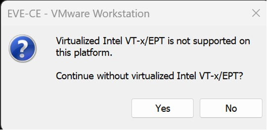

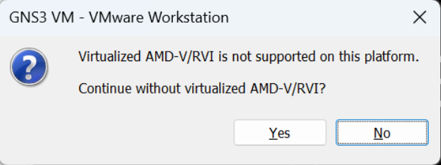

> [!IMPORTANT]
>
> Please follow the resolution steps, while making sure to reboot where instructed and to test if the VM is working **BETWEEN each REBOOT** step.

> [!WARNING]
>
> Disabling VBS is not a quick or simple process. Seriously, take your time and stay **patient**, very very very **PATIENT**. Patience now saves hours of pain later. **Resist the urge to jump ahead** or gloss over sections. Read **every single word** of these instructions carefully before you start.

Virtualization-Based Security (VBS) frequently re-enables itself after a reboot on Windows 11 because multiple, redundant security layers (Group Policy, Registry, Core Isolation, and BIOS) are configured to keep it on, particularly after Windows updates. To permanently disable VBS, you must disable all its interconnected components simultaneously, as disabling just one (like Memory Integrity) will cause it to reactivate.

## Confirm your system Intel VT-x or AMD-V is active

Opening the task manager -> performance -> CPU. Confirm your devices virtualization technology is enabled.  If it is set to “Disable” please check your laptop user manual on how to access the BIOS/UEFI settings to enable.

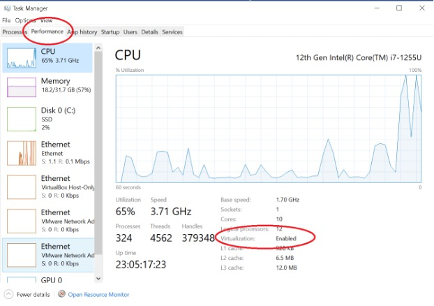

## Confirm Your Windows is Pro/Enterprise/Education Edition and is Fully Patched

Open Settings -> Windows updates.

If you are not running Windows Pro/Enterprise/Education edition, get Windows 11 Education Edition for free. Log into https://azureforeducation.microsoft.com/devtools

Find Windows 11 Education here: https://portal.azure.com/#view/Microsoft_Azure_Education/EducationMenuBlade/~/software

## How to Check if VBS is Enabled in Windows 11 or 10

https://www.tomshardware.com/how-to/disable-vbs-windows-11

Before you start thinking about turning off VBS, you need to find out if it's on in the first place. 

1. **Open system information**. The easiest way to do that is by searching for "system information" in Windows search and clicking the top result.
   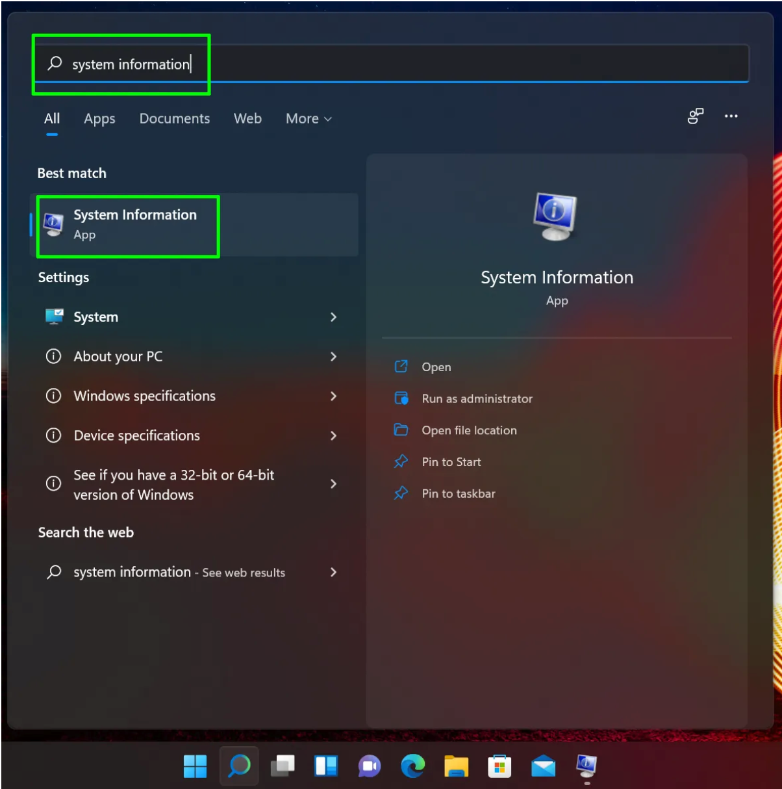

(Image credit: Future)

2. **Scroll down to find the "Virtualization-based security" row.** If it says "running," VBS is enabled. But if it says "not enabled," then you're done.
   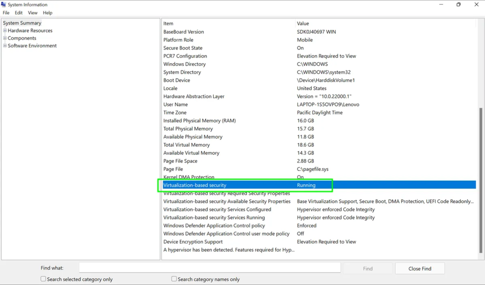

## How to Disable VBS / HVCI in Windows 11 or 10

1. **Search for Core Isolation** in Windows search and **click the top result**.
   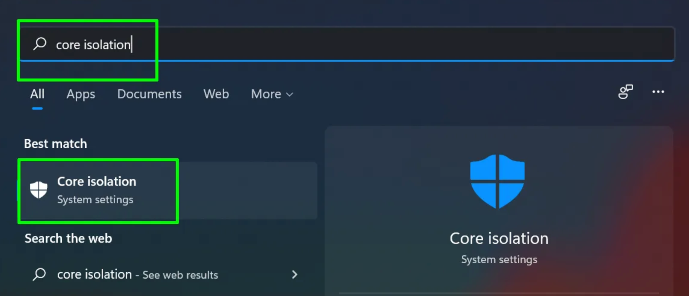

(Image credit: Future)

**2. Toggle Memory Integrity to off**, if it was on. If it is not on, skip ahead to step 5.
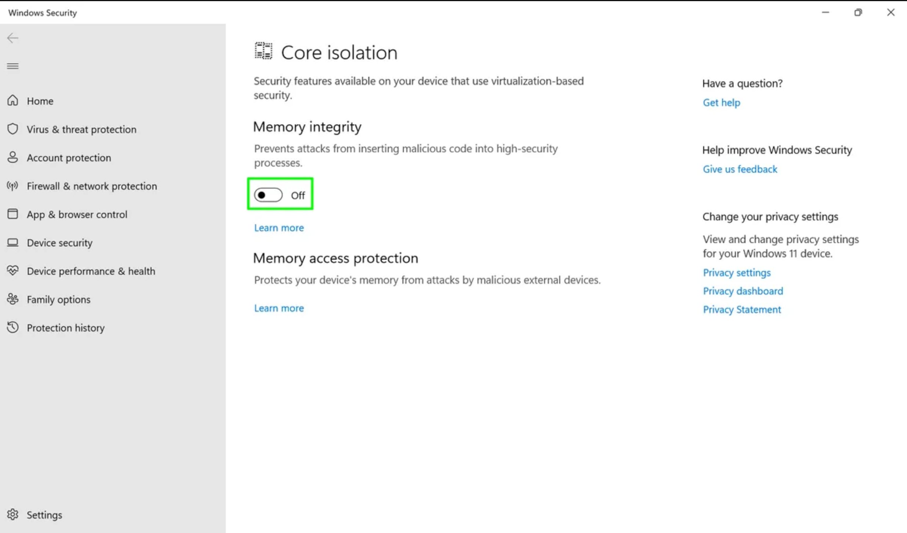 

(Image credit: Future)

3. **Reboot your PC** as prompted.

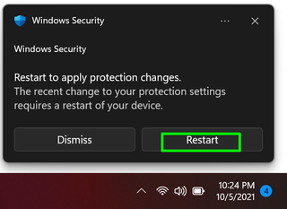 

(Image credit: Future)

4. **Check system info** again to see if virtualization-based security is listed as "not enabled." Reboot again and check if it's still "not enabled". If so, you are done. If not, move on to disable VBS in the GPO in the next step.
   

(Image credit: Future)

5. **Open gpedit.msc**. The easiest way is by hitting Windows + R, entering `gpedit.msc` in the text box and click OK.
6. Navigate to: **Computer Configuration > Administrative Templates > System > Device Guard**, Set **Turn On Virtualization Based Security** to **Disabled**.
   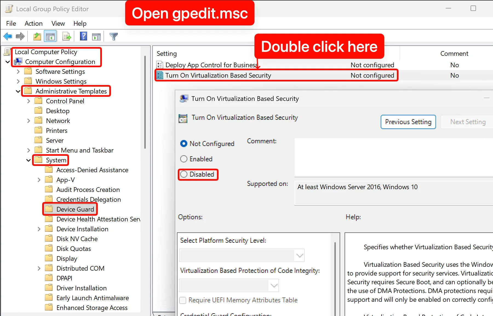 
7. **Open regedit**. The easiest way is by hitting Windows + R, entering `regedit` in the text box and click OK.
   

(Image credit: Future)

6. **Navigate to HKEY_LOCAL_MACHINE\System\CurrentControlSet\Control\DeviceGuard.** The **EnableVirtualizationBasedSecurity** entry may or may not exist. If the entry exists, set it to 0. If the entry does NOT exist, create a new one and set it to 0. If you don't understand this instruction, read the next step carefully.
   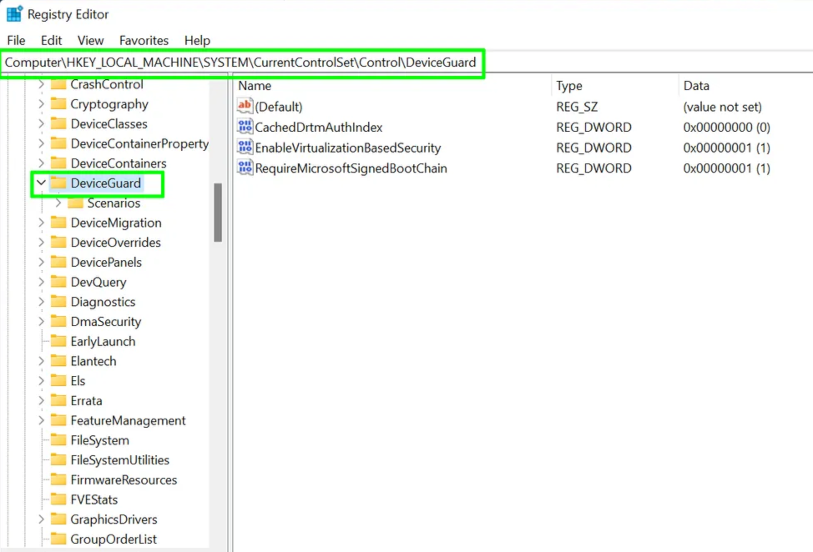

(Image credit: Future)

7. **Open EnableVirtualizationBasedSecurity** and **set it to 0.** 
   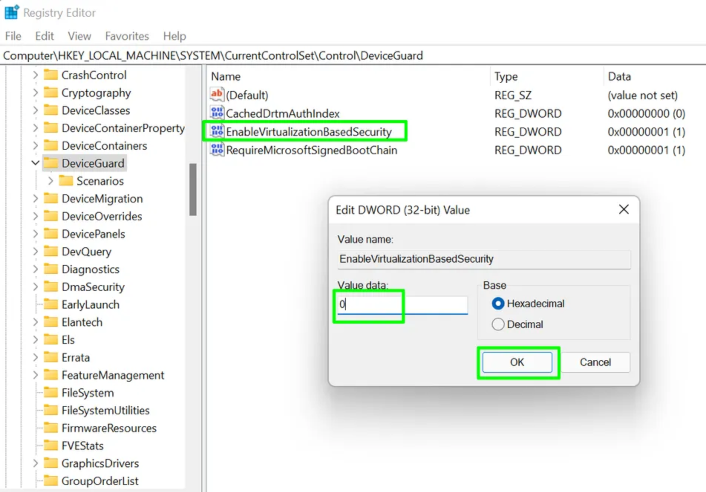

(Image credit: Future)

**If the entry does not exist, create a new one** with the key **EnableVirtualizationBasedSecurity**, value (DWORD 32-bit) 0.

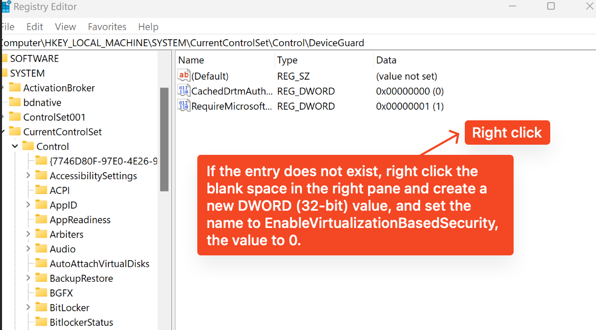

8. Reset **WindowsHello**.
   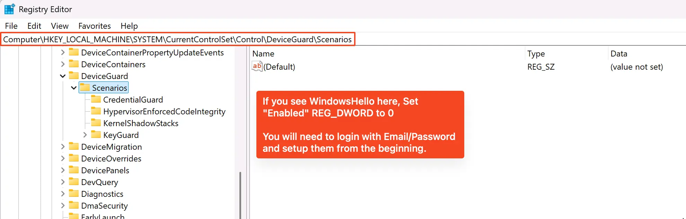 
9. **Close regedit** and **reboot your PC**.
10. **Check system information again** to see if Virtualization Based Security is listed as  "not enabled." 
      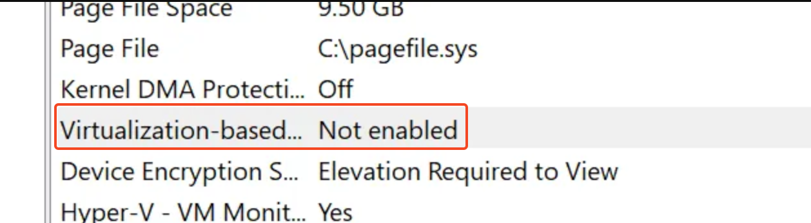

(Image credit: Future)

If VBS is still enabled try the method of disabling it below.

## How to Disable Windows VBS By Uninstalling Virtual Machine

If you still see that VBS is running, you can get rid of it by uninstalling the "Virtual Machine" feature in Windows. Note, however, that if this is the feature that's enabling VBS for you, losing it may cost you the ability to run Windows Subsystem for Linux. Here's how you do it.

1. **Open Turn Windows Features on or Off** by searching for it.
   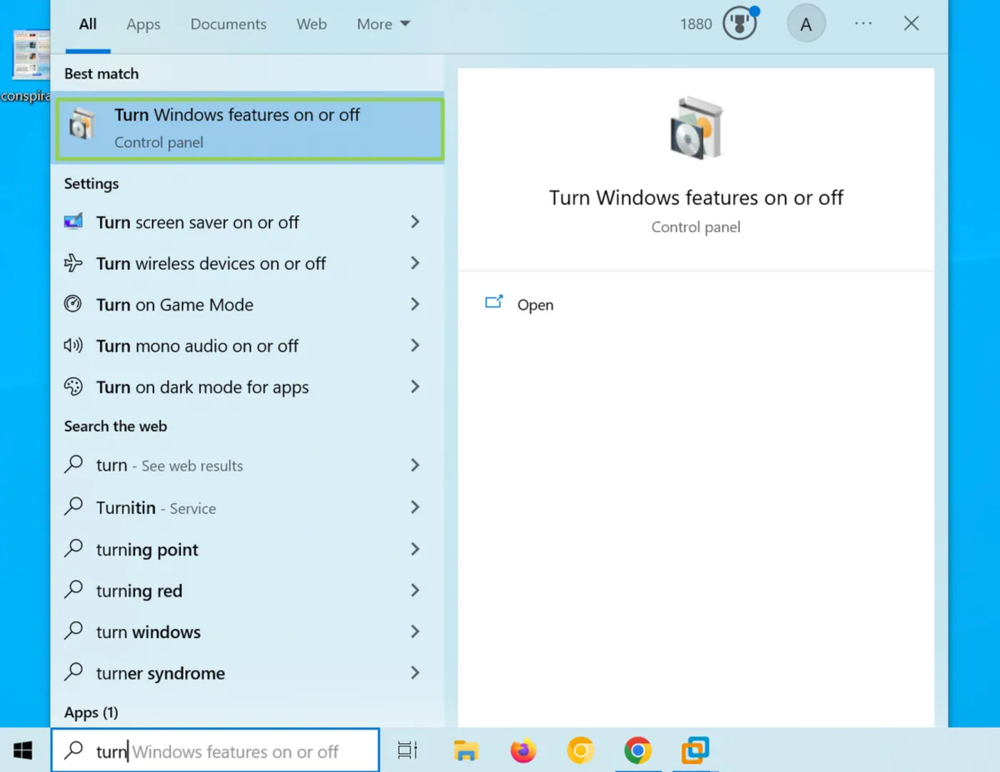

(Image credit: Future)

2. **Uncheck Hyper-V, Virtual Machine Platform and Windows Hypervisor Platform** and **click Ok**. You **may or may not have Hyper-V** feature depending on your PC vendor’s customized installation of Windows.
   
   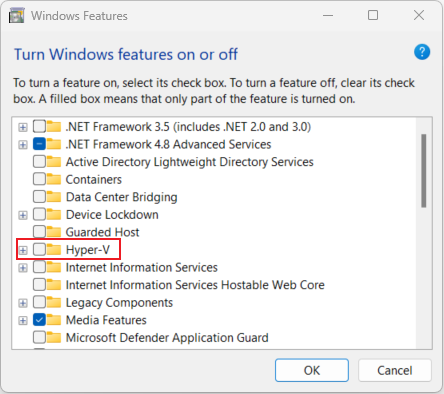 
   
   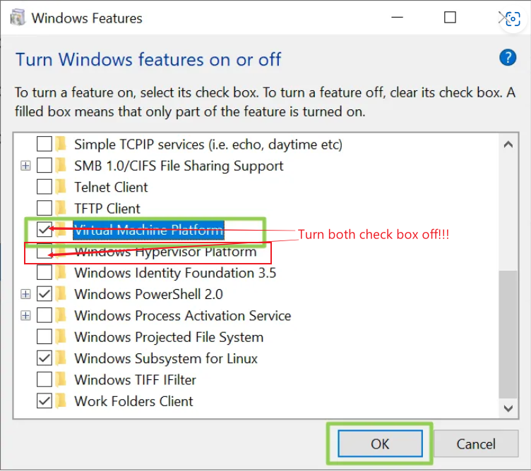 

(Image credit: Future)

3. **Reboot** your PC.

## Microsoft Device Guard and Credential Guard hardware readiness tool

> [!NOTE]
>
> **Please note that using this option will disable features on your laptop like fingerprint scanning and other biometric devices**

1. If you don't know how to unzip a `.zip` file, watch this: https://www.youtube.com/watch?v=gFhfrPMy6BY. [7zip](https://www.7-zip.org/download.html) is recommended for zipping and unzipping.

2. Download and unzip Device Guard and Credential Guard hardware readiness tool from https://www.microsoft.com/en-us/download/details.aspx?id=53337

3. Start PowerShell as an **Administrator**.
   ````powershell
   Set-ExecutionPolicy RemoteSigned
   ````

   Answer `Y` when prompted.

4. Enter the folder that contains **unzipped** Device Guard and Credential Guard hardware readiness tool, then run:
   ````
   powershell.exe -ExecutionPolicy Bypass -File .\DG_Readiness_Tool_v3.6.ps1 -Disable
   ````
5. After running you will need to reboot your computer, during the reboot process you will be asked if you want to disable credential guard and device guard.

   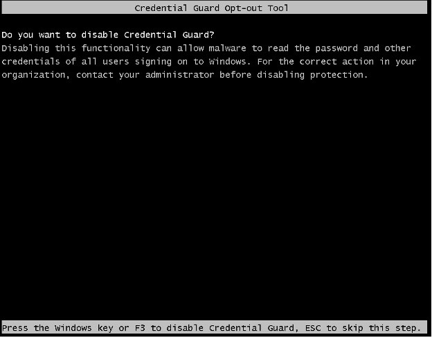  

6. Press **F3** to disable Credential Guard

   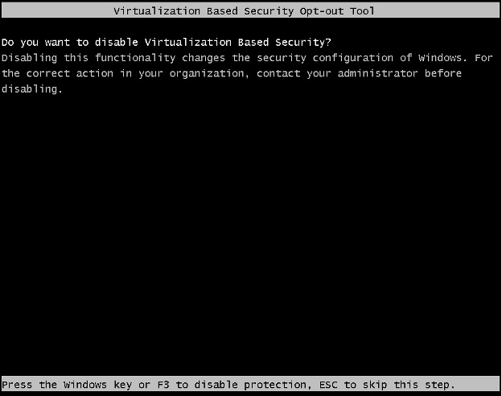  

7. Press **F3** to disable Virtualization Based Security

8. Reboot
9. **Check system information** again to make sure virtualization based security is listed as "not enabled."

---

> [!NOTE]
>
> **If your PC vendor is Lenovo, you may see VBS status is “Enabled but not running”. If you can run VM with Intel VT-x/AMD-V enabled, it's also acceptable.**
